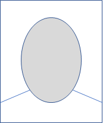
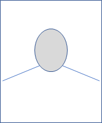

# MAX78002 Facial Recognition Demo


## Overview
This demo application includes **FaceDetection** and **FaceID** CNN models and runs them sequentially on MAX78002 EVKIT. CNN model weights and configurations are programmed only once and there is no need to reload them.
The **FaceDetection** CNN model detects a face and application draws a box around the face.

The **FaceID** CNN model demonstrates identification of a number of persons from their facial images.

For this purpose, the **FaceID** CNN model generates a 64-length embedding for a given image, whose distance to whole embeddings stored for each subject is calculated. The image is identified as either one of these subjects or 'Unknown' depending on the embedding distances.

The **FaceID** CNN model is trained with the VGGFace-2 dataset using MTCNN and FaceNet models for embedding generation.

## FaceID Demo Software

### Building firmware

Navigate directory where Facial Recognition demo software is located and build the project:

```bash
$ cd /Examples/MAX78002/CNN/facial_recognition
$ make
```

If this is the first time after installing tools, or peripheral files have been updated, first clean drivers before rebuilding the project:

```bash
$ make distclean
```

### Load firmware image to MAX78002 EVKIT

Connect 5V power supply to J1 and turn ON power switch (SW1).

Connect PICO adapter to JH8 SWD header.

If you are using Windows, load the firmware image with OpenOCD in a MinGW shell:

```bash
openocd -s $MAXIM_PATH/Tools/OpenOCD/scripts -f interface/cmsis-dap.cfg -f target/max78002.cfg -c "program build/MAX78002.elf reset exit"
```

If using Linux, perform this step:

```bash
./openocd -f tcl/interface/cmsis-dap.cfg -f tcl/target/max78002.cfg -c "program build/MAX78002.elf verify reset exit"
```


## Face Database Generation

This section describes how to add new pictures to the data base.
There are two ways to generate the database:
   - Using the MAX78002 EVKIT
   - Using the python script

### Using the MAX78002 EVKIT
On the MAX78002 EVKIT, the Mobilefacenet_112 CNN model can be used to generate the database. The steps are as follows:
   - Program the demo firmware to the MAX78002 EVKIT as described above.
   - Press the record button on the TFT display to start record mode.
   - Write the name of the person to be added to the database using the keyboard on the TFT display.(Note: Maximum 6 characters can be written.)
   - Press OK button on the TFT display to proceed.
   - Press the camera button on the TFT display to take a picture.
   - If the picture is OK, press OK button on the TFT display to save the picture to the database. Otherwise, press Retry button to take another picture.
   - Press Cnt? button to add another picture to the database. Otherwise, press Exit button to exit the record mode.

### Using the python script
#### Prerequisites:

Requires ai8x-training environment. Please refer to [ai8x-training](https://github.com/MaximIntegratedAI/ai8x-training?tab=readme-ov-file#installation) for environment installation instructions.

#### Taking Face Pictures

In order to achieve best identification, following steps are recommended:

1. Phone or webcam can be used to take pictures.
2. Make sure the subject face is well illuminated.

3. Pictures should be a passport style, with subject's face covering about 60-70% of the area:



4. Use a light color background; make sure it is not underexposed, and there is no shadow in the background or face.

5. Take one picture with each of the following poses, total of 6-8 pictures:

   a) facing directly to camera (1 picture)

   b) tilting face slightly (5-10 degree) to right, left, up and down, but still looking at the camera (4 pictures)

   c) zoomed out face directly to camera covering about 20-30% of area (1 picture):



6. If needed, you may add additional 1-2 pictures with some facial expressions (eg. smile) directly facing the camera, similar to 5-a (1-2 pictures)

7. Save pictures in .jpg format with arbitrary names.

#### Populate Face Images

Navigate to 'db' folder and create a folder for each subject in your database and copy each subject's photos into these folders. The name of the folder will be used as the detected subject's name. These photos must contain subject's face directed to the camera but do not need to be consisting only the face. The structure of the directory should be as the following.

```bash
├── db
    ├── Name1
    │    ├── Image1.jpg
    │    ├── Image2.jpg
    │    ├── Image3.jpg
    │    ├── Image4.jpg
    │    ├── Image5.jpg
    │    └── Image6.jpg
    └── Name2
         ├── Image1.jpg
         ├── Image2.jpg
         ├── Image3.jpg
         ├── Image4.jpg
         └── Image5.jpg
```

Having at least 5 images per subject is recommended. There must be no other person in the images besides the subject. For the both the images in the database and in the operation time, the face should be well and evenly illuminated.

#### Generate DB

Run the python script by:

```bash
$ sh gen_db.sh
```

The script updates embeddings.h file under 'include' folder using the images under 'db' folder.  Next, you can rebuild the project and load the firmware as described before:

```bash
cd$ make clean
$ make
```


## CNN Model Design
### Problem Definition
To identify people from 3 channel (RGB) frontal facial images, i.e. portraits. Small amount of rotations should be considered to have a robust application.

### Approach
Detailed description of the approach can be found in [Facial Recognition System](https://github.com/MaximIntegratedAI/ai8x-training/blob/develop/docs/FacialRecognitionSystem.md) document.

## References

[1] https://github.com/MaximIntegratedAI/MaximAI_Documentation
